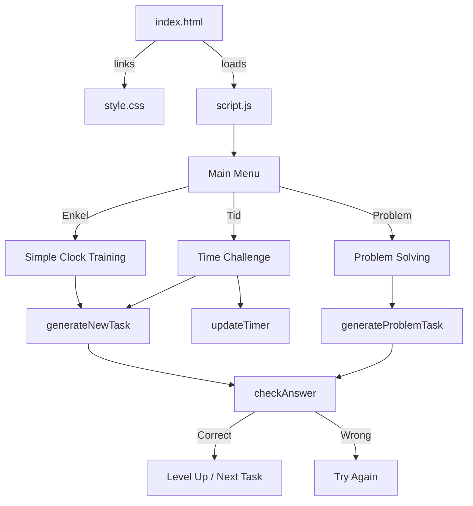
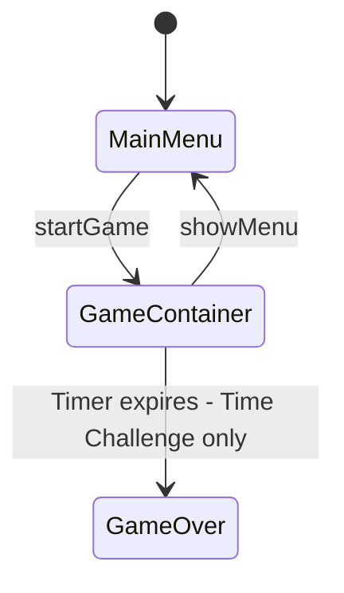

# Klockspelet — Project Documentation

## Overview

**Klockspelet** ("The Clock Game") is a Swedish-language educational web application designed to help users — primarily children — learn to tell time on an analog clock. The game features an interactive clock face with draggable hands and multiple game modes that progressively increase in difficulty.

## Tech Stack

| Layer    | Technology                  |
|----------|-----------------------------|
| Markup   | HTML5                       |
| Styling  | CSS3 (vanilla)              |
| Logic    | Vanilla JavaScript (ES6)    |
| Hosting  | Static files — no build step |

No external libraries, frameworks, or dependencies are used. The entire application consists of three files.

---

## File Structure

```
Klockspelet/
├── index.html    # Page structure and UI elements
├── style.css     # All styling — layout, clock, menu, game UI
├── script.js     # Game logic, clock interaction, drag-and-drop
└── plans/
    └── README.md # This documentation
```

---

## Architecture



---

## Game Modes

### 1. 🧠 Enkel klockträning (Simple Clock Training)
- Displays a target time as either digital format (e.g. `08:30`) or Swedish text (e.g. "halv nio").
- The user sets the clock hands to match the target.
- No time pressure.
- Difficulty increases through levels (see [Leveling System](#leveling-system)).

### 2. ⏱️ Tidsutmaning (Time Challenge)
- Same mechanics as Simple Training, but with a **30-second countdown timer**.
- Each correct answer adds **+3 seconds** to the timer.
- Game ends when the timer reaches zero.
- Tasks appear faster (500ms delay between tasks vs. 2000ms in simple mode).

### 3. 🕵️ Problemlösning (Problem Solving)
- Presents a **word problem** in Swedish, e.g.:
  > "Elias börjar cykla klockan 08:00. Det håller på i 45 minuter. Vad är klockan när Elias är klar?"
- The user must calculate the end time and set the clock accordingly.
- Uses randomized names and activities for variety.
- 3-second delay between tasks on correct answer.

---

## Leveling System

The game uses a streak-based leveling system (applies to Simple and Time Challenge modes):

| Level | Minute Granularity         | Description                    |
|-------|----------------------------|--------------------------------|
| 1     | Full hours only (`:00`)    | Easiest — only whole hours     |
| 2     | `:00` or `:30`             | Introduces half hours          |
| 3     | `:00`, `:15`, `:30`, `:45` | Quarter-hour intervals         |
| 4     | Every 5 minutes            | Full 5-minute resolution       |

**Level-up condition:** 5 correct answers in a row (`streak >= 5`). Maximum level is 4.

---

## Key Functions in [`script.js`](script.js)

| Function | Purpose |
|----------|---------|
| [`startGame(mode)`](script.js:5) | Initializes a game session for the selected mode |
| [`updateStats()`](script.js:35) | Updates the on-screen score, streak, and level display |
| [`showMenu()`](script.js:41) | Returns to the main menu and clears the timer |
| [`updateTimer()`](script.js:47) | Decrements the countdown timer for Time Challenge mode |
| [`updateClock()`](script.js:57) | Rotates the clock hands based on current `gameHours` and `gameMinutes` |
| [`addTime(h, m)`](script.js:64) | Adds hours/minutes via the control buttons |
| [`timeToSwedishText(h, m)`](script.js:71) | Converts a numeric time to Swedish clock-reading text |
| [`generateNewTask()`](script.js:91) | Creates a new time-matching task for Simple/Time modes |
| [`generateProblemTask()`](script.js:116) | Creates a word problem for Problem Solving mode |
| [`checkAnswer()`](script.js:142) | Validates the user's clock setting against the target |
| [`getAngle(e)`](script.js:177) | Calculates the angle from the clock center to the pointer/touch position |
| [`startDrag(e, hand)`](script.js:187) | Initiates drag interaction on a clock hand |
| [`doDrag(e)`](script.js:198) | Handles ongoing drag movement to update clock hands |

---

## Clock Interaction

The analog clock supports two input methods:

1. **Buttons** — `+ 1 Timme`, `+ 15 Minuter`, `+ 5 Minuter` buttons increment the time.
2. **Drag and drop** — Both mouse and touch events are supported. Users can grab either the hour or minute hand and drag it around the clock face.

### Drag Implementation Details
- The angle from the clock center to the cursor is calculated using [`getAngle()`](script.js:177) with `Math.atan2`.
- **Minute hand:** Snaps to 5-minute intervals (`Math.round(a/30)*30/6`).
- **Hour hand:** Snaps to whole hours (`Math.round(a/30) || 12`).
- Touch events use `{passive: false}` to prevent page scrolling during drag.

---

## UI Structure

The UI has two main states controlled by toggling the `.hidden` CSS class:



### Main Menu (`#main-menu`)
- Title and subtitle
- Three mode-selection buttons

### Game Container (`#game-container`)
- Back button to return to menu
- Timer display (visible only in Time Challenge mode)
- Stats board: Level, Score, Streak
- Task/instruction area with target time badge
- Analog clock with 12 numbers and two hands
- Control buttons and check button

---

## Styling Highlights

- **Color palette:** Teal (`#00695C`, `#004D40`) as primary, amber (`#FFB300`, `#FF8F00`) for accents, red for errors/timer.
- **Clock numbers** use CSS `transform: rotate() translateY() rotate()` for circular positioning.
- **`pointer-events: none`** on clock numbers prevents them from interfering with hand dragging.
- **`user-select: none`** across the game container prevents accidental text selection during interaction.
- **Responsive-friendly:** Uses `max-width: 400px` on menu buttons and percentage-based widths.

---

## Swedish Time Expressions

The [`timeToSwedishText()`](script.js:71) function converts times to idiomatic Swedish clock expressions:

| Minutes | Swedish Expression | Example (3:XX) |
|---------|-------------------|-----------------|
| :00     | *[hour]*          | "tre"           |
| :05     | fem över *[hour]* | "fem över tre"  |
| :10     | tio över *[hour]* | "tio över tre"  |
| :15     | kvart över *[hour]* | "kvart över tre" |
| :20     | tjugo över *[hour]* | "tjugo över tre" |
| :25     | fem i halv *[next hour]* | "fem i halv fyra" |
| :30     | halv *[next hour]* | "halv fyra"     |
| :35     | fem över halv *[next hour]* | "fem över halv fyra" |
| :40     | tjugo i *[next hour]* | "tjugo i fyra"  |
| :45     | kvart i *[next hour]* | "kvart i fyra"  |
| :50     | tio i *[next hour]* | "tio i fyra"    |
| :55     | fem i *[next hour]* | "fem i fyra"    |

---

## Names and Activities (Problem Solving Mode)

The problem-solving mode uses randomized names and activities defined in [`generateProblemTask()`](script.js:116):

- **Names:** Elias, Ahmad, Rasmus, Hawbir, Kismah, Anki, Annika, Hanna G, Hanna B, Anna, Emin, Brittis, Evelina, Klas, Christian, Conny, Cecilia, Carro, Catalin, Mi, Aya, Barnabe
- **Activities:** bada, cykla, läsa, titta på TV, träna, äta frukost, spela fotboll, ha rast, rita, spela roblox, rätta prov
- **Durations:** 15, 30, 45, 60, or 90 minutes

---

## Potential Improvements

- **Reset clock button** — Currently there is no way to reset the clock hands to 12:00 without reloading.
- **Subtract time buttons** — Only additive buttons exist; users cannot subtract hours or minutes.
- **Sound effects** — No audio feedback for correct/incorrect answers.
- **Score persistence** — Scores are lost on page reload; could use `localStorage`.
- **Accessibility** — No ARIA labels or keyboard navigation for the clock.
- **Responsive design** — The 300px fixed clock size may be too large or small on some devices.
- **Minute hand drag precision** — The minute hand snaps to 5-minute intervals via angle rounding, which can feel imprecise at certain positions.
