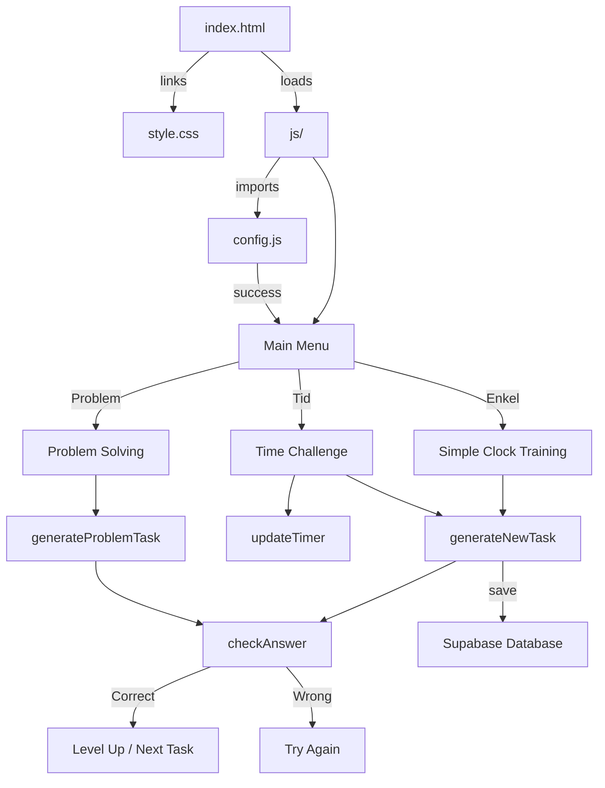
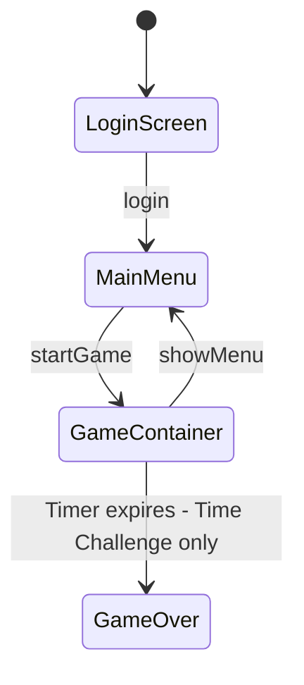

# Klockspelet — Project Documentation

## Overview

**Klockspelet** ("The Clock Game") is a Swedish-language educational web application designed to help users — primarily children — learn to tell time on an analog clock. The game features an interactive clock face with draggable hands and multiple game modes that progressively increase in difficulty.

## Tech Stack

| Layer    | Technology                  |
|----------|-----------------------------|
| Markup   | HTML5                       |
| Styling  | CSS3 (vanilla)              |
| Logic    | Vanilla JavaScript (ES6)    |
| Database | Supabase (PostgreSQL)       |
| Auth     | Custom (name + class)       |

---

## File Structure

```
Klockspelet/
├── index.html         # Page structure and UI elements
├── style.css          # All styling — layout, clock, menu, game UI
├── js/
│   ├── config.js      # Configuration and global variables
│   ├── init.js        # DOMContentLoaded initialization
│   ├── auth.js        # Login, logout, offline authentication
│   ├── stats.js       # User statistics management
│   ├── game.js        # Game logic, timer, clock display
│   ├── tasks.js       # Task generation and answer checking
│   ├── interactions.js # Drag & drop clock interaction
│   └── admin.js       # Admin dashboard
└── supabase/
    ├── schema.sql     # Database schema (tables, policies)
    └── SETUP.md       # Supabase setup instructions
```

---

## Architecture



---

## Login System

### Overview
The app uses a simple login system where users select their class (3A-3E) and enter their name. The combination of name + class uniquely identifies each user, and all game statistics are saved to a Supabase database.

### Login Flow
1. User selects class from dropdown (3A, 3B, 3C, 3D, 3E)
2. User enters their name
3. System checks if this name+class combination exists in the database
4. If exists: loads existing user profile and statistics
5. If new: creates new profile and initializes statistics

### Database Schema

**profiles table:**
| Column    | Type    | Description              |
|-----------|---------|-------------------------|
| id        | UUID    | Primary key             |
| name      | TEXT    | User's name             |
| class     | TEXT    | Class (3A-3E)           |
| created_at | TIMESTAMP | Registration time     |

**player_stats table:**
| Column      | Type    | Description              |
|-------------|---------|-------------------------|
| id          | UUID    | Primary key             |
| user_id     | UUID    | References profiles.id |
| mode        | TEXT    | 'enkel', 'tid', 'problem' |
| score       | INTEGER | Highest score           |
| level       | INTEGER | Highest level reached  |
| max_streak  | INTEGER | Highest streak achieved|
| games_played| INTEGER | Total games played     |
| last_played | TIMESTAMP | Last game time       |

### Offline Mode
If Supabase is not configured (SUPABASE_URL = 'DIN_SUPABASE_URL'), the app falls back to localStorage for data persistence.

---

## Game Modes

### 1. 🧠 Enkel klockträning (Simple Clock Training)
- Displays a target time as either digital format (e.g. `08:30`) or Swedish text (e.g. "halv nio").
- The user sets the clock hands to match the target.
- No time pressure.
- Difficulty increases through levels (see [Leveling System](#leveling-system)).

### 2. ⏱️ Tidsutmaning (Time Challenge)
- Same mechanics as Simple Training, but with a **30-second countdown timer**.
- Each correct answer adds **+3 seconds** to the timer.
- Game ends when the timer reaches zero.
- Tasks appear faster (500ms delay between tasks vs. 2000ms in simple mode).

### 3. 🕵️ Problemlösning (Problem Solving)
- Presents a **word problem** in Swedish, e.g.:
  > "Elias börjar cykla klockan 08:00. Det håller på i 45 minuter. Vad är klockan när Elias är klar?"
- The user must calculate the end time and set the clock accordingly.
- Uses randomized names and activities for variety.
- 3-second delay between tasks on correct answer.

---

## Leveling System

The game uses a streak-based leveling system (applies to Simple and Time Challenge modes):

| Level | Minute Granularity         | Description                    |
|-------|----------------------------|--------------------------------|
| 1     | Full hours only (`:00`)    | Easiest — only whole hours     |
| 2     | `:00` or `:30`             | Introduces half hours          |
| 3     | `:00`, `:15`, `:30`, `:45` | Quarter-hour intervals         |
| 4     | Every 5 minutes            | Full 5-minute resolution       |

**Level-up condition:** 5 correct answers in a row (`streak >= 5`). Maximum level is 4.

---

## Key Functions by Module

| Function | Purpose |
|----------|---------|
### config.js
| Function | Purpose |
|----------|--------|
| `SUPABASE_URL` | Supabase project URL |
| `SUPABASE_ANON_KEY` | Supabase anon key |
| Global variables | `gameHours`, `gameMinutes`, `score`, `streak`, `level`, etc. |

### init.js
| Function | Purpose |
|----------|--------|
| `DOMContentLoaded` listener | Initializes app on page load |

### auth.js
| Function | Purpose |
|----------|--------|
| [`login()`](js/auth.js:51) | Handles login with class + name |
| [`offlineLogin()`](js/auth.js:112) | Fallback login using localStorage |
| [`logout()`](js/auth.js:156) | Logs out the current user |
| [`showMainMenu()`](js/auth.js:166) | Shows the main menu after login |
### stats.js
| Function | Purpose |
|----------|--------|
| [`loadUserStats()`](js/stats.js:19) | Loads player statistics from Supabase |
| [`updateStatsSummary()`](js/stats.js:44) | Updates stats display in menu |
| [`saveGameResult()`](js/stats.js:79) | Saves game results to database |
| [`saveOfflineStats()`](js/stats.js:119) | Saves stats to localStorage |
### game.js
| Function | Purpose |
|----------|--------|
| [`startGame(mode)`](js/game.js:19) | Initializes a game session for the selected mode |
| [`updateStats()`](js/game.js:52) | Updates the on-screen score, streak, and level display |
| [`showMenu()`](js/game.js:58) | Returns to the main menu and saves game results |
| [`updateTimer()`](js/game.js:68) | Decrements the countdown timer for Time Challenge mode |
| [`updateClock()`](js/game.js:85) | Rotates the clock hands based on current `gameHours` and `gameMinutes` |
| [`addTime(h, m)`](js/game.js:93) | Adds hours/minutes via the control buttons |
### tasks.js
| Function | Purpose |
|----------|--------|
| [`timeToSwedishText(h, m)`](js/tasks.js:20) | Converts a numeric time to Swedish clock-reading text |
| [`generateNewTask()`](js/tasks.js:49) | Creates a new time-matching task for Simple/Time modes |
| [`generateProblemTask()`](js/tasks.js:75) | Creates a word problem for Problem Solving mode |
| [`checkAnswer()`](js/tasks.js:109) | Validates the user's clock setting against the target |
### interactions.js
| Function | Purpose |
|----------|--------|
| [`getAngle(e)`](js/interactions.js:11) | Calculates the angle from the clock center to the pointer/touch position |
| [`startDrag(e, hand)`](js/interactions.js:22) | Initiates drag interaction on a clock hand |
| [`doDrag(e)`](js/interactions.js:31) | Handles ongoing drag movement to update clock hands |

### admin.js
| Function | Purpose |
|----------|--------|
| [`adminLogin()`](js/admin.js:18) | Admin login and data fetching |
| [`filterAdminStats()`](js/admin.js:64) | Filters stats by class/mode |
| [`calculateTotalScores()`](js/admin.js:82) | Calculates total scores per student |
| [`renderAdminTable()`](js/admin.js:149) | Renders the admin stats table |
| [`renderAdminSummary()`](js/admin.js:180) | Renders admin summary statistics |

---

## Clock Interaction

The analog clock supports two input methods:

1. **Buttons** — `+ 1 Timme`, `+ 15 Minuter`, `+ 5 Minuter` buttons increment the time.
2. **Drag and drop** — Both mouse and touch events are supported. Users can grab either the hour or minute hand and drag it around the clock face.

### Drag Implementation Details
- The angle from the clock center to the cursor is calculated using [`getAngle()`](js/interactions.js:11) with `Math.atan2`.
- **Minute hand:** Snaps to 5-minute intervals (`Math.round(a/30)*30/6`).
- **Hour hand:** Snaps to whole hours (`Math.round(a/30) || 12`).
- Touch events use `{passive: false}` to prevent page scrolling during drag.

---

## UI Structure

The UI has three main states controlled by toggling the `.hidden` CSS class:



### Login Screen (`#login-screen`)
- Class selection dropdown (3A-3E)
- Name input field
- Login button

### Main Menu (`#main-menu`)
- User info display (name + class)
- Stats summary for each game mode
- Three mode-selection buttons
- Logout button

### Game Container (`#game-container`)
- Back button to return to menu
- Timer display (visible only in Time Challenge mode)
- Stats board: Level, Score, Streak
- Task/instruction area with target time badge
- Analog clock with 12 numbers and two hands
- Control buttons and check button

---

## Styling Highlights

- **Color palette:** Teal (`#00695C`, `#004D40`) as primary, amber (`#FFB300`, `#FF8F00`) for accents, red for errors/timer.
- **Clock numbers** use CSS `transform: rotate() translateY() rotate()` for circular positioning.
- **`pointer-events: none`** on clock numbers prevents them from interfering with hand dragging.
- **`user-select: none`** across the game container prevents accidental text selection during interaction.
- **Responsive-friendly:** Uses `max-width: 400px` on menu buttons and percentage-based widths.

---

## Swedish Time Expressions

The [`timeToSwedishText()`](js/tasks.js:20) function converts times to idiomatic Swedish clock expressions:

| Minutes | Swedish Expression | Example (3:XX) |
|---------|-------------------|-----------------|
| :00     | *[hour]*          | "tre"           |
| :05     | fem över *[hour]* | "fem över tre"  |
| :10     | tio över *[hour]* | "tio över tre"  |
| :15     | kvart över *[hour]* | "kvart över tre" |
| :20     | tjugo över *[hour]* | "tjugo över tre" |
| :25     | fem i halv *[next hour]* | "fem i halv fyra" |
| :30     | halv *[next hour]* | "halv fyra"     |
| :35     | fem över halv *[next hour]* | "fem över halv fyra" |
| :40     | tjugo i *[next hour]* | "tjugo i fyra"  |
| :45     | kvart i *[next hour]* | "kvart i fyra"  |
| :50     | tio i *[next hour]* | "tio i fyra"    |
| :55     | fem i *[next hour]* | "fem i fyra"    |

---

## Names and Activities (Problem Solving Mode)

The problem-solving mode uses randomized names and activities defined in [`generateProblemTask()`](js/tasks.js:75):

- **Names:** Elias, Ahmad, Rasmus, Hawbir, Kismah, Anki, Annika, Hanna G, Hanna B, Anna, Emin, Brittis, Evelina, Klas, Christian, Conny, Cecilia, Carro, Catalin, Mi, Aya, Barnabe
- **Activities:** bada, cykla, läsa, titta på TV, träna, äta frukost, spela fotboll, ha rast, rita, spela roblox, rätta prov
- **Durations:** 15, 30, 45, 60, or 90 minutes

---

## Supabase Setup

See [`supabase/SETUP.md`](supabase/SETUP.md) for detailed setup instructions.

### Quick Setup:
1. Create project at [supabase.com](https://supabase.com)
2. Run [`supabase/schema.sql`](supabase/schema.sql) in SQL Editor
3. Copy Project URL and anon key to [`js/config.js`](js/config.js:7-8)

---

## Potential Improvements

- **Reset clock button** — Currently there is no way to reset the clock hands to 12:00 without reloading.
- **Subtract time buttons** — Only additive buttons exist; users cannot subtract hours or minutes.
- **Sound effects** — No audio feedback for correct/incorrect answers.
- **Admin dashboard** — Teachers could view all students' statistics.
- **Accessibility** — No ARIA labels or keyboard navigation for the clock.
- **Responsive design** — The 300px fixed clock size may be too large or small on some devices.
- **Minute hand drag precision** — The minute hand snaps to 5-minute intervals via angle rounding, which can feel imprecise at certain positions.
